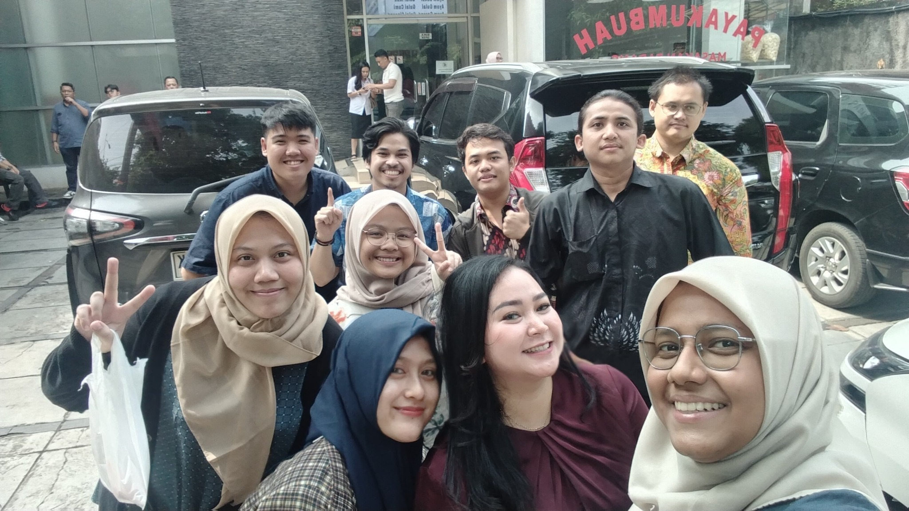
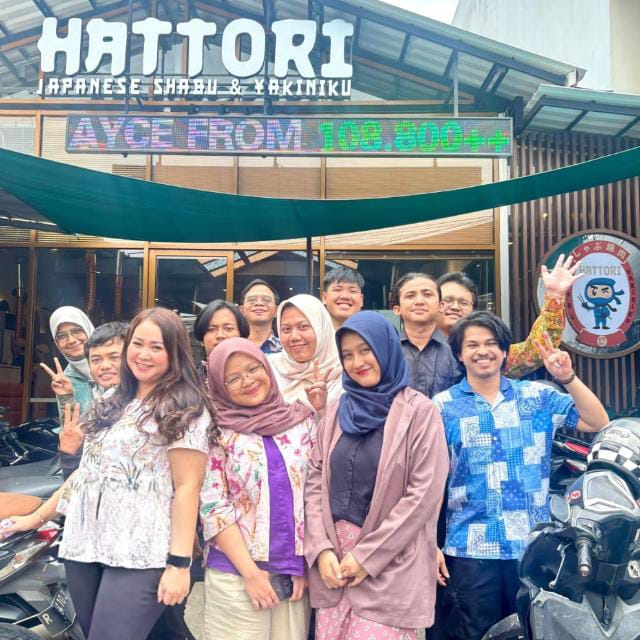

# Cerita David

Website cerita pribadi satu halaman, dibuat untuk membagikan catatan tentang rekan kerja yang resign setelah hubungan di kantor terasa akrab dan kekeluargaan. Cerita pertama ditujukan untuk mengenang kebersamaan dengan **Mbak Vit**, rekan di HR yang bersedia mendengarkan karyawan dan menjaga hubungan dengan manajemen.

Proyek memakai **HTML, CSS, dan JavaScript biasa**. CSS dan JavaScript masih menyatu di `index.html`. Foto berada di folder `assets`. Halaman dapat dibuka langsung di browser atau dilayani oleh web server statis pada infrastructure cloud milik David.

Dokumen ini mencakup struktur proyek, perilaku halaman, panduan menjalankan dan mengedit, keputusan desain terbaru, serta naskah cerita lengkap.

## 0. Memulai kembali setelah full reset

Gunakan README ini sebagai acuan mandiri untuk memulihkan atau membangun kembali proyek. Kebutuhan tampilan, aturan interaksi, nama tokoh, foto, dan seluruh naskah sudah tercantum di sini.

Jika memakai paket `ceritadavid-repository.zip`, ekstrak lalu salin folder `ceritadavid` ke repository. Paket tersebut sudah berisi halaman HTML terbaru, README, dan kedua foto. Setelah itu buka `index.html` atau jalankan server lokal seperti pada Bagian 5.

Jika ingin membangun ulang dengan bantuan coding agent, gunakan instruksi berikut bersama README ini:

> Bangun ulang proyek Cerita David berdasarkan README ini. Buat satu halaman statis dengan HTML, CSS, dan JavaScript biasa. Gunakan struktur folder pada Bagian 2 dan naskah lengkap pada Bagian 11. Pembuka harus memiliki dua foto di dalam kartu, di atas tombol Buka ceritanya dan Tolak. Tolak terus menghindar dan labelnya tetap Tolak. Jangan tambahkan tombol Lewati pembuka atau teks / Untuk Mbak pada header. Nama rekan HR adalah Mbak Vit. Pertahankan kalimat pagi yang sudah disunting. Buat layout responsif untuk HP dan desktop, galeri foto yang dapat diperbesar, serta tautan lagu yang sudah ditentukan. Gunakan foto yang disertakan. Logo biru menunggu file asli David. Terapkan animasi ringan dan reduced motion sesuai Bagian 3. Proyek tidak memakai database atau proses build. Seluruh perilaku dan konten lainnya mengikuti README ini.

Jika implementasi HTML dibuat ulang, periksa ulang hasilnya sesuai Bagian 10. Catatan pemeriksaan implementasi sebelumnya tidak otomatis berlaku pada kode baru.

## 1. Identitas dan ruang lingkup

| Item | Nilai |
| --- | --- |
| Nama website | Cerita David |
| Nama penulis | David |
| Domain yang direkomendasikan | `ceritadavid.blog` |
| Judul cerita | Let’s Journey into the World |
| Edisi | Vol. 01 |
| Tanggal tulisan | 1 Oktober 2026 |
| Lokasi pada tanda tangan | Tebet, Jakarta Selatan |
| Rekan HR yang diceritakan | Mbak Vit |
| Bahasa | Bahasa Indonesia, dengan beberapa istilah pekerjaan dan ungkapan Inggris |
| Bentuk aplikasi | Satu halaman statis |
| Database | Tidak digunakan |
| Proses build / instalasi paket | Tidak diperlukan |
| Hosting | Server atau layanan static hosting yang dipilih David |

`ceritadavid.blog` adalah pilihan nama domain, bukan klaim bahwa domain sudah dibeli, tersedia, atau dihubungkan ke server. Tanggal tulisan tetap 1 Oktober 2026 meskipun halaman dibagikan setelah farewell party.

## 2. Struktur folder repository

Paket repository menyediakan satu folder `ceritadavid`. Folder ini dapat ditempatkan di root repository yang sudah ada, atau isinya dapat menjadi root repository baru.

| Path di dalam folder `ceritadavid` | Fungsi |
| --- | --- |
| `README.md` | Dokumentasi proyek, keputusan desain, panduan, dan naskah lengkap |
| `index.html` | Halaman utama beserta CSS dan JavaScript |
| `assets/kenangan-bersama.jpg` | Foto lebar, digunakan pada pembuka, awal cerita, dan galeri |
| `assets/kumpul-lagi.jpg` | Foto kotak, digunakan pada pembuka dan galeri |

Jika dimasukkan ke repository yang sudah ada, letakkan keempat path tersebut di dalam subfolder yang sama. Referensi foto menggunakan path relatif `assets/...`, sehingga folder foto perlu tetap berada di sebelah `index.html`.

**Sumber halaman yang dijalankan browser adalah `index.html`.** Naskah di README merupakan salinan untuk dokumentasi dan penyuntingan. Markdown belum diproses otomatis menjadi HTML. Saat cerita diubah, perbarui teks pada `index.html` dan bagian naskah di README agar keduanya konsisten.

## 3. Pengalaman pembaca

### Pembuka

Saat halaman dibuka dengan JavaScript aktif, dialog pembuka tampil seperti sebuah kartu surat di atas latar gelap.

- Header kartu berisi **Cerita David** dan angka edisi **01**.
- Judul pembuka: **Sebelum lanjut, baca sebentar?**
- Deskripsi: **Ada sedikit cerita tentang kantor, orang-orangnya, dan perjalanan berikutnya. Boleh dibaca pelan-pelan.**
- Dua foto berada **di dalam kartu**, berjajar **di atas tombol**.
- Foto diputar sedikit melalui CSS, seperti foto yang diselipkan pada surat. File foto aslinya tidak diputar.
- Pilihan tombol hanya **Buka ceritanya** dan **Tolak**.
- Tidak ada tombol **Lewati pembuka**.
- Header pembuka tidak memakai tambahan **/ Untuk Mbak**.

### Tombol Buka ceritanya

Tombol ini menjalankan animasi kartu membuka, kemudian menampilkan halaman cerita. Durasi animasi normal sekitar 650 ms. Fokus keyboard dipindahkan ke judul cerita tanpa memaksa perubahan posisi scroll.

### Tombol Tolak

Tombol ini sengaja dibuat sebagai humor kecil pada pembuka.

- Menghindar ketika mouse masuk ke area tombol.
- Berpindah ketika disentuh di HP atau diaktifkan lewat keyboard.
- Terus menghindar; tidak berhenti setelah dua kali.
- Label tetap **Tolak**.
- Posisi berpindah bergantian di bagian bawah area pilihan.
- Perpindahan tetap dibatasi di dalam area `letterChoices`.
- Tombol tidak menutup cerita atau menjalankan tindakan penolakan lain.

Pesan kecil di bawahnya berganti di antara:

1. Eh, tombolnya kabur 😄
2. Sepertinya dia ingin ceritanya dibuka.
3. Curhatnya belum selesai, tombolnya sudah kabur.

### Setelah cerita terbuka

Urutan halaman:

1. Header website **cerita david.** dan tombol **Tutup cerita**.
2. Judul, pengantar singkat, penulis, tanggal, dan perkiraan waktu baca.
3. Foto lebar bersama rekan kerja.
4. Empat bagian cerita: pagi, kabar resign, koneksi, dan perjalanan berikutnya.
5. Analogi visual karyawan, HR sebagai pendengar, dan manajemen.
6. Tautan lagu Bernadya.
7. Galeri kenangan.
8. Ucapan penutup dan tanda tangan David.

Tombol **Tutup cerita** membuka kembali kartu pembuka dan mereset posisi tombol Tolak. Posisi baca pada halaman dipertahankan.

### Galeri dan foto yang diperbesar

Galeri menampilkan dua kolom pada desktop dan satu kolom pada HP. Foto galeri dapat ditekan untuk membuka dialog foto besar. Caption dan teks alternatif mengikuti foto yang dipilih.

Dialog foto dapat ditutup melalui tombol **Tutup foto**, klik pada latar dialog, atau tombol Esc. Setelah ditutup, pembaca kembali ke halaman dan dapat melanjutkan scroll.

### Keyboard, animasi, dan JavaScript

- Tombol memakai elemen `button` dengan indikator fokus.
- Dialog pembuka memakai elemen `dialog` bawaan browser.
- Esc pada dialog pembuka tetap dapat menampilkan cerita sebagai akses keyboard; ini bukan tombol tambahan pada tampilan.
- Preferensi `prefers-reduced-motion` menghilangkan transisi dan animasi bertahap. Tombol Tolak tetap berpindah secara langsung.
- Cerita tetap tersedia jika JavaScript dinonaktifkan; pembuka dan pembesaran foto membutuhkan JavaScript.
- Animasi bagian cerita muncul sekali saat bagian tersebut memasuki area pandang.
- Garis pada header mengikuti posisi scroll pembaca, tanpa menyimpan data pembaca.

## 4. Arah visual

Tampilan menyerupai catatan pribadi dengan foto kenangan: latar terang untuk membaca, serif untuk cerita, dan latar gelap pada pembuka serta ucapan terakhir.

| Elemen | Nilai saat ini |
| --- | --- |
| Latar halaman | `#FCFBF8` |
| Teks utama / latar gelap | `#172735` |
| Teks sekunder | `#5F676B` |
| Garis pemisah | `#DDDCD4` |
| Aksen judul dan kutipan | `#9A5925` |
| Fokus dan aksen diagram | `#284F9A` |
| Font cerita | Georgia, dengan fallback Times New Roman / serif |
| Font antarmuka | Font sistem perangkat |
| Lebar maksimum kartu pembuka | 550 px |

Layout sudah memiliki aturan untuk HP dan desktop. Pada layar kecil, judul dan paragraf menyesuaikan lebar layar, bagian cerita menjadi satu kolom, dan kedua foto pembuka tetap berada di dalam kartu. Foto memakai `object-fit: contain` agar seluruh foto terlihat.

Halaman memakai font sistem serta CSS dan JavaScript lokal, sehingga tampilan utama tidak bergantung pada CDN.

### Logo

Favicon saat ini adalah ikon sementara huruf **d** pada latar gelap. Logo biru asli David belum dipasang.

Saat `davidaryasetia.site` diperiksa, ikon yang tersedia adalah huruf **D** berwarna toska. Logo tersebut belum dianggap sebagai logo biru yang dimaksud David. Gunakan file logo asli yang dikonfirmasi atau diberikan David sebelum mengganti identitas proyek. Jangan menggambar ulang logo berdasarkan tebakan.

## 5. Menjalankan proyek secara lokal

### Membuka langsung

Ekstrak folder `ceritadavid`, kemudian buka `index.html` di browser. Foto, CSS, dan JavaScript berada di dalam paket. Internet hanya diperlukan ketika pembaca membuka tautan YouTube.

### Memakai server lokal

Jika Python 3 sudah terpasang, jalankan dari terminal:

```sh
cd ceritadavid
python3 -m http.server 8080 --bind 127.0.0.1
```

Pada Windows yang memakai Python Launcher:

```powershell
cd ceritadavid
py -m http.server 8080 --bind 127.0.0.1
```

Buka `http://127.0.0.1:8080/`. Hentikan server lokal dengan Ctrl+C setelah selesai.

## 6. Memasang pada server

Untuk domain yang melayani halaman ini dari root, salin `index.html` dan folder `assets` ke document root yang sama.

Contoh document root: `/var/www/ceritadavid`.

Contoh konfigurasi awal Nginx:

```nginx
server {
    listen 80;
    server_name ceritadavid.blog www.ceritadavid.blog;

    root /var/www/ceritadavid;
    index index.html;

    location / {
        try_files $uri $uri/ =404;
    }
}
```

Ganti `server_name` jika domain yang akhirnya dibeli berbeda. Contoh ini adalah konfigurasi HTTP awal; pengaturan HTTPS mengikuti server atau reverse proxy milik David.

DNS yang digunakan mengikuti domain dan server yang benar-benar dipilih:

| Record | Tujuan |
| --- | --- |
| A untuk domain utama (`@`) | IP publik server yang melayani website |
| CNAME untuk `www`, jika alias ini digunakan | Domain utama |

Setelah konfigurasi Nginx disimpan, periksa dengan:

```sh
sudo nginx -t
```

Jika pemeriksaan berhasil, muat ulang konfigurasi:

```sh
sudo systemctl reload nginx
```

Aktifkan HTTPS setelah DNS dan jalur server siap. README ini tidak menjalankan perubahan DNS, membeli domain, atau mempublikasikan website secara otomatis.

`README.md` dapat tetap berada di repository; file yang diperlukan untuk menyajikan halaman adalah `index.html` dan `assets`.

## 7. Mengedit cerita

Teks cerita dapat diubah langsung di `index.html`. Bagian utama berada di dalam elemen `article`; empat bagian narasi berada di dalam `div` dengan ID `cerita`.

Pertahankan keputusan berikut saat mengedit:

- Nama website **Cerita David** dan nama penulis **David**.
- Rekan HR pada paragraf pengenalan disebut **Mbak Vit**.
- Sudut pandang memakai **saya**.
- Gaya bahasa santai, mudah dipahami, sedikit humor, dan terasa personal.
- Kejadian mengikuti cerita David. Jangan menambah percakapan, nama, lokasi, atau kejadian yang belum diberikan.
- Analogi networking digunakan secukupnya: segmen jaringan, default gateway, paket data, dan rute.
- Cerita yang dipercayakan kepada HR tidak semuanya diteruskan kepada manajemen. Animasi paket curhat berhenti di pendengar.
- Kalimat pagi memakai **bangun tidur, berdoa sejenak, lalu merapikan kasur**. Frasa **mengucap syukur** sudah dihapus atas permintaan David.
- Dua foto pembuka tetap di dalam kartu, sebelum tombol.
- Tombol tetap **Buka ceritanya** dan **Tolak**; tidak ada **Lewati pembuka**.
- Teks **/ Untuk Mbak** tidak ditambahkan kembali ke header kartu.

Jika tanggal tulisan berubah, sinkronkan teks tanggal, atribut `datetime` pada elemen `time`, tanda tangan, dan naskah pada README.

## 8. Mengganti dan menambah foto

### Foto yang tersedia

| File | Ukuran asli | Digunakan pada |
| --- | --- | --- |
| `assets/kenangan-bersama.jpg` | 2048 × 1152 px | Kartu pembuka, foto awal, galeri |
| `assets/kumpul-lagi.jpg` | 640 × 640 px | Kartu pembuka dan galeri |

Untuk mengganti foto dengan cepat, ganti file dengan nama yang sama. Perbarui caption, teks `alt`, `aria-label`, serta atribut ukuran gambar agar sesuai dengan foto baru.

### Menambah foto pada galeri

1. Simpan file foto baru di folder `assets`.
2. Cari `div` dengan class `memory-gallery` di `index.html`.
3. Tambahkan satu elemen `figure` untuk setiap foto.
4. Gunakan class `photo-button` agar pembesaran foto terhubung dengan JavaScript yang sudah ada.
5. Tulis caption singkat sesuai kenangan sebenarnya.

Contoh struktur; `foto-farewell.jpg` harus diganti dengan file yang benar-benar sudah ditambahkan:

```html
<figure class="memory-photo">
  <button class="photo-button" type="button"
          aria-label="Perbesar foto farewell bersama rekan-rekan">
    
  </button>
  <figcaption>Isi caption sesuai foto dan kenangan yang ingin disimpan.</figcaption>
</figure>
```

Sesuaikan `width` dan `height` dengan ukuran gambar sebenarnya. Class tambahan `wide-photo` dapat digunakan jika foto galeri ingin ditampilkan dengan bingkai lebar 16:9 seperti foto utama.

Jumlah foto galeri tidak dibatasi oleh kode. Ukuran file dan jumlah foto tetap memengaruhi waktu muat di HP. Foto galeri menggunakan `loading="lazy"` agar tidak semuanya dimuat di awal. Dua foto pada kartu pembuka tetap dipilih secara terpisah dari foto tambahan di galeri.

## 9. Lagu yang menyertai cerita

Lagu yang dipilih adalah **Kita Buat Menyenangkan — Bernadya**.

Tautan yang dipakai:

[Bernadya — Kita Buat Menyenangkan, video resmi](https://www.youtube.com/watch?v=sdnDInjdWjw)

Halaman membuka video tersebut di tab baru ketika tautan dipilih. Tidak ada autoplay, file audio, atau lirik lagu yang disertakan pada proyek.

## 10. Pemeriksaan sebelum dibagikan

Pemeriksaan yang sudah dilakukan pada versi HTML yang disertakan dalam paket repository ini:

- Sintaks JavaScript diperiksa.
- Path foto lokal dan ID elemen HTML diperiksa.
- Alur buka dan tutup kartu diperiksa melalui simulasi DOM.
- Tombol Tolak diperiksa dengan simulasi mouse dan sentuhan hingga 48 perpindahan.
- Akses keyboard, perilaku reduced motion, serta buka-tutup galeri diperiksa melalui simulasi DOM.

Pemeriksaan tersebut bukan pengujian visual browser. Browser rendering langsung tidak tersedia pada sesi pembuatan. Layout perlu dilihat pada browser/perangkat yang akan digunakan sebelum halaman dibagikan.

Daftar pemeriksaan manual:

- [ ] Buka halaman di desktop dan HP.
- [ ] Pastikan dua foto terlihat di dalam kartu pembuka.
- [ ] Pastikan Buka ceritanya mudah dijangkau.
- [ ] Dekati atau sentuh Tolak beberapa kali; pastikan terus berpindah dalam area pilihan.
- [ ] Buka cerita, scroll, lalu gunakan Tutup cerita.
- [ ] Perbesar foto galeri, kemudian tutup dan lanjutkan membaca.
- [ ] Periksa caption, ejaan Mbak Vit, tanggal, dan tanda tangan.
- [ ] Pastikan seluruh wajah pada foto tetap terlihat.
- [ ] Periksa hasil dengan pengaturan reduced motion jika tersedia.
- [ ] Setelah dihosting, periksa foto, domain, dan HTTPS melalui perangkat pembaca.

## 11. Naskah lengkap

### Let’s Journey into the World

**Vol. 01 · David · 1 Oktober 2026 · Tebet, Jakarta Selatan**

Tentang rekan kerja yang mau mendengar, dan kabar resign yang ternyata bikin kepikiran.



*Foto bersama yang ingin saya simpan sebagai kenangan.*

#### 01 — Pagi yang terasa sedikit berbeda.

Pagi itu, Kamis, 1 Oktober 2026, langit Jakarta sedikit mendung. Jalanan mulai riuh oleh suara kendaraan bermotor, sementara kamar saya masih cukup sunyi. Alarm berbunyi pukul 05.30 WIB, ditemani dengung AC yang masih menyala. Kasur terasa nyaman. Sebagai orang yang menyukai hawa dingin, rasanya selalu butuh sedikit usaha untuk beranjak. AC sudah mode *Powerful*, semangat bangunnya masih *loading*.

Rutinitasnya seperti biasa: bangun tidur, berdoa sejenak, lalu merapikan kasur. Setelah mandi dan menyiapkan keperluan, saya bersiap berangkat kerja. Aktivitas yang sama setiap pagi, dan kadang memang terasa sedikit membosankan.

Tetapi pagi itu ada sesuatu yang terasa berbeda. Pikiran saya berusaha menjalani hari seperti biasa, sementara perasaan saya masih mengganjal. Sulit dijelaskan dengan kata-kata. Entah kenapa, saya memikirkan kantor dan orang-orang yang setiap hari saya temui di sana.

Di tempat itu, kami tumbuh bersama dalam sebuah tim kecil. Pekerjaan menuntut kami belajar dan berkembang dengan cepat, tetapi di sela kesibukannya juga terbentuk rasa akrab dan kekeluargaan. Di tengah kerasnya hidup di perantauan, kedekatan seperti itu membuat hari-hari kerja terasa sedikit lebih ringan.

#### 02 — Yang membuat kantor terasa dekat.

Belakangan, ada kabar di kantor bahwa salah satu rekan kerja akan mengundurkan diri. Ia sudah mengajukan pemberitahuan satu bulan sebelum meninggalkan pekerjaannya, atau *one month notice*. Bagi sebagian dari kami, kabar itu cukup mengejutkan.

Resign memang hal yang wajar dalam dunia kerja. Tetap saja, rasanya berbeda ketika yang akan pergi adalah seseorang yang sudah dekat dengan kita. Seseorang yang selama ini bersedia mendengarkan keluh kesah, bahkan ketika cerita itu hanya perlu didengar. Yang membuat sedikit sedih justru membayangkan hal-hal biasa: percakapan di sela pekerjaan, atau rasa lega setelah selesai bercerita.

Mbak Vit adalah seorang HR yang cukup akrab dengan rekan-rekan di kantor. Perannya terasa strategis karena ia bisa menjaga hubungan baik dengan karyawan maupun manajemen. Ia mau menerima cerita dan masukan, termasuk dari karyawan biasa seperti saya.

Tentu tidak semua cerita harus diteruskan ke atasan. Ada hal-hal yang cukup berhenti sebagai percakapan, dan bagi saya, didengarkan saja kadang sudah membuat hati sedikit lega.

Saya membayangkan, di sisi lain, ia mungkin juga menjadi tempat bercerita bagi atasan. Barangkali mereka pun punya keluh kesah yang tidak bisa dibagikan kepada semua karyawan. Menjaga kepercayaan di antara kedua sisi itu tentu membutuhkan kepekaan.

#### 03 — Ada koneksi yang tidak terlihat di layar monitoring.

Sebagai orang yang sehari-hari berkutat dengan *network*, saya terbiasa memikirkan cara agar perangkat di segmen jaringan yang berbeda tetap bisa saling berkomunikasi. Tapi di kantor, ada koneksi yang jarang terlihat di layar monitoring: **rasa percaya antara orang-orangnya.** Kalau boleh memakai sedikit bahasa pekerjaan, perannya mirip *default gateway*, pintu penghubung yang membantu komunikasi antarjaringan. Dalam cerita ini, dua sisi itu adalah karyawan dan manajemen, dengan posisi dan tanggung jawab yang berbeda.

Kami datang membawa “paket data” masing-masing. Ada masukan, ada pertanyaan, kadang ada keluh kesah yang sudah terlalu panjang untuk diringkas dalam satu chat. Dia bersedia mendengarkan. Untungnya, kalau mau cerita, kami tidak perlu isi formulir atau bikin tiket dulu. Bisa langsung bicara sebagai sesama manusia.

*Ada cerita yang cukup sampai pada seseorang yang mau mendengar.*

Begitu tahu ia akan pergi, rasanya seperti menyadari bahwa jalur yang sudah akrab akan berubah. Kami tentu bisa menyesuaikan diri. Tapi mungkin nanti ada momen ketika saya ingin bercerita, lalu baru ingat: oh iya, dia sudah tidak di sini.

> Kalau urusan jaringan, saya bisa mencari rute baru. Untuk kebiasaan bercerita kepada orang yang sama, sepertinya saya juga perlu memberi diri sendiri sedikit waktu.

#### 04 — Sedihnya boleh ada. Hangatnya juga.

Meski terasa sedikit sedih, saya percaya setiap orang punya tujuan hidup yang ingin dikejar. Bisa jadi ada langkah baru dalam karier, atau peluang di luar sana yang terasa lebih cocok. Saya pun punya tujuan sendiri, jadi saya bisa memahami keinginan untuk melanjutkan perjalanan.

Ada yang bilang dunia ini luas, ada juga yang merasa dunia ini sempit. Saya belum tahu mana yang lebih tepat. Mungkin nanti, di suatu tempat, perjalanan kami bisa bertemu lagi. Semoga hubungan baik yang sudah terjalin tetap bisa dijaga.

Saya jadi teringat lagu Bernadya, *Kita Buat Menyenangkan*. Buat saya, lagu itu cocok untuk hari ini. Selagi masih bisa bertemu di kantor, saya ingin menikmati waktu yang ada, tetap bekerja seperti biasa, dan menyisakan ruang untuk tertawa. Sedihnya boleh ada. Semoga kenangan yang dibawa pulang tetap hangat.

[Kita Buat Menyenangkan — Bernadya](https://www.youtube.com/watch?v=sdnDInjdWjw)

Saya juga teringat kata yang sering disampaikan Mr. Jayden dan para atasan di sini: “Semangat.” Singkat, tetapi cukup membekas saat pekerjaan terasa padat dan melelahkan. Mungkin kali ini, semangat itu juga bisa menjadi bekal untuk perjalanan Mbak berikutnya.

#### Galeri kenangan — Foto-foto yang mau saya simpan.

Semoga nanti masih ada waktu buat kumpul dan ngobrol lagi. Untuk sekarang, saya simpan foto-foto ini dulu.


*Foto bersama yang ingin saya simpan sebagai kenangan.*



*Semoga nanti masih bisa kumpul dan foto begini lagi.*

#### Untuk perjalanan berikutnya — Good luck, Mbak.

Senang bisa bertemu dan berkenalan denganmu. Kita sama-sama anak daerah yang sedang mengadu nasib di Jakarta, sama-sama belajar bertahan dalam sibuknya ibu kota.

Terima kasih sudah mau mendengar. Semoga langkah berikutnya membawa banyak hal baik untukmu.

*See you at the top.*

**David**  
Tebet, Jakarta Selatan  
1 Oktober 2026

## 12. Kredit

- Naskah: David.
- Foto: foto yang disediakan David.
- Referensi lagu: Bernadya — Kita Buat Menyenangkan, melalui tautan video resmi.
- Logo biru: menunggu file asli yang dimaksud David.

Dokumentasi mengikuti versi halaman yang sudah memakai nama Mbak Vit, dua foto di dalam kartu pembuka, tombol Tolak yang terus menghindar, dan kalimat pagi tanpa frasa mengucap syukur.
